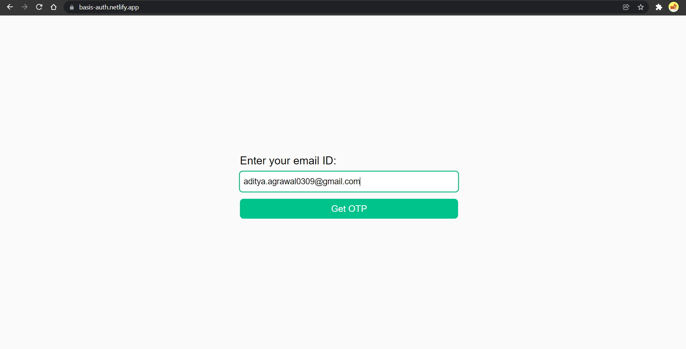
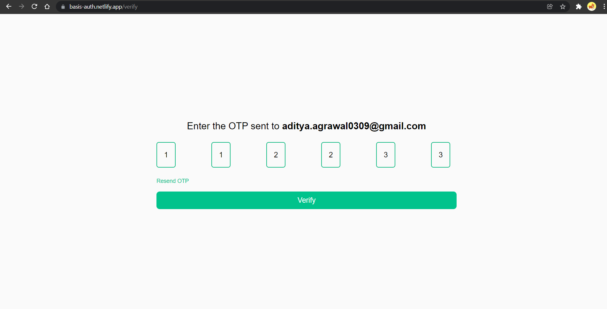
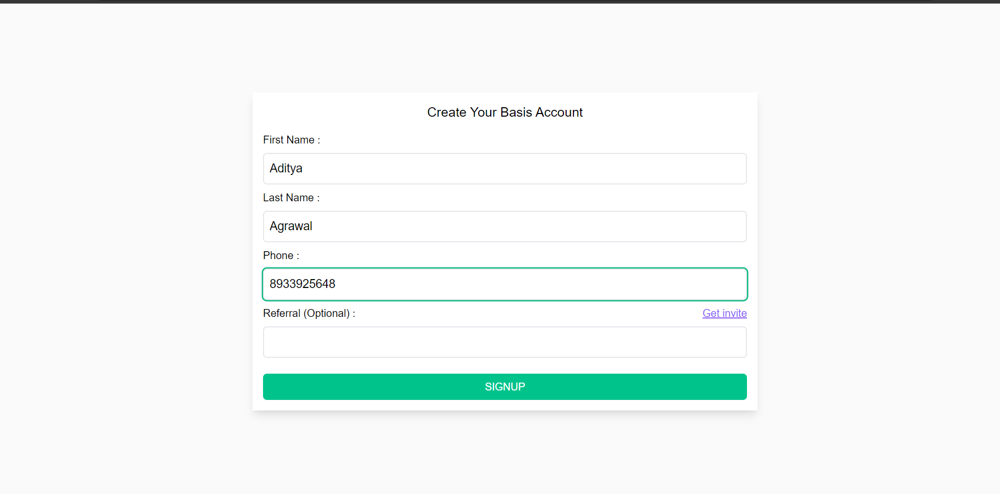
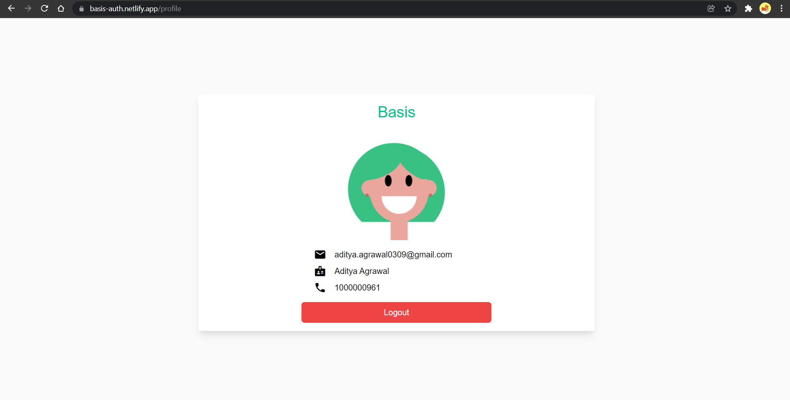

# Basis User Authentication
A **responsive** web app built in react-redux which authenticate users.

## API
- the base url which performs all authentication steps in this project - [https://hiring.getbasis.co/candidate](https://hiring.getbasis.co/candidate).
- the base invite url to get the referral code - [https://basis-invite-url.aditya365.repl.co](https://basis-invite-url.aditya365.repl.co)

## Tech-stack
 - React
 - Redux-Toolkit
 - TailwindCSS
 - React-Router-v6
 - EMAIL-JS for sending OTP

## How it works?
 - user enters the email address   (**email verification page**)
 - an otp is is sent to their mail  (**otp verification page**)
   - after entering otp
      - if otp is correct
        - new user will be directed to sign up page  
        - existing user will be directed to profile page 
      - if otp is incorrect
         - user is allowed to enter wrong otp only 3 times, in the third attempt user will be redirected to home page i.e. email verfication page
    - if user clicks on resend otp
      - otp will be resent to the email only 3 times, in the third attempt user will be redirected to home page i.e. email verfication page
  - **signup page**
    - user fills the details like first name, last name, phone number and referral code (optional)
    - if user decides to fill the referral code
      - user will be allowed to signup only after entering valid referral code 
    - if user decides to leave the referral code blank
      - user will be allowed to signup
    - if user clicks on `Get Invite` link, the referral code will auto-fill with a valid value
  - **profile page**
    - user can see the details like name, email and phone number
    - user can also logout from the profile page

## Routes with screens
  - `https://basis-auth.netlify.app/` 
  
    
    
  - `https://basis-auth.netlify.app/verify`

    

  - `https://basis-auth.netlify.app/signup`

    

  - `https://basis-auth.netlify.app/profile`

    
     

## Setup
  - `npx create-react-app folder-name --template redux` for configuring react and redux-roolkit. Visit official [docs](https://redux.js.org/introduction/installation) for more information.
  - `npm install history react-router-dom@next` for configuring react-router-v6 (beta version). Visit official [docs](https://github.com/remix-run/react-router/blob/main/docs/api.md) for more information.
  - Visit [tailwind docs](https://tailwindcss.com/docs/guides/create-react-app) for configuring tailwind in CRA.
  - `npm i axios` to setup axios and make API calls.
  - Use [EMAILJS](https://www.emailjs.com/) for sending otp to the users. You can refer to their official [docs](https://www.emailjs.com/docs/) to setup the EMAILJS DASHBOARD.

## Deployment
  - The wesbite is deployed on [netlify](https://app.netlify.com/).
  - The deployment is very easy, just add `CI=false` in the environment variable while deploying and you're good to go.
  - In your code, add a `_redirects` file in your `public` folder. In that file, add this code - `/*    /index.html   200`, this will fix the issue of reloading pages of wesbite when deployed on netlify.
